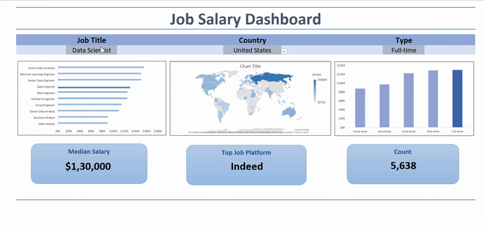

# 📊 Job Salary Analysis Dashboard (Excel Project)

## Introduction
This project is a beginner-friendly Excel dashboard created to analyze salaries for different job roles across countries. I built this project while learning Excel from an online course, using a sample dataset provided in the course resources.

The aim of this project was to practice organizing data, applying basic Excel functions, and creating simple visual charts to understand salary patterns across various tech jobs.

---

## 📸 Dashboard Preview
**

---

## 🧰 Excel Tools & Features Practiced

- **Basic formulas** (SUM, AVERAGE, COUNT, etc.)
- **Sorting and filtering**
- **Data Validation** (dropdowns)
- **Charts**
  - Column charts
  - Bar charts
  - Filled Map charts
- **Sheet formatting & layout design**
- **Using structured tables** for easier data handling

---

## Conclusion
Building this dashboard helped me strengthen my foundational Excel skills. I learned how to manage structured datasets, create visual insights, and format sheets for clearer presentation. This project is one of my first steps into data analytics and gave me practical experience with Excel tools used for real-world analysis.

