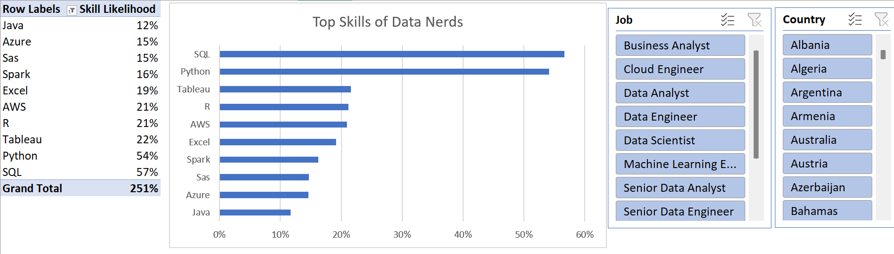
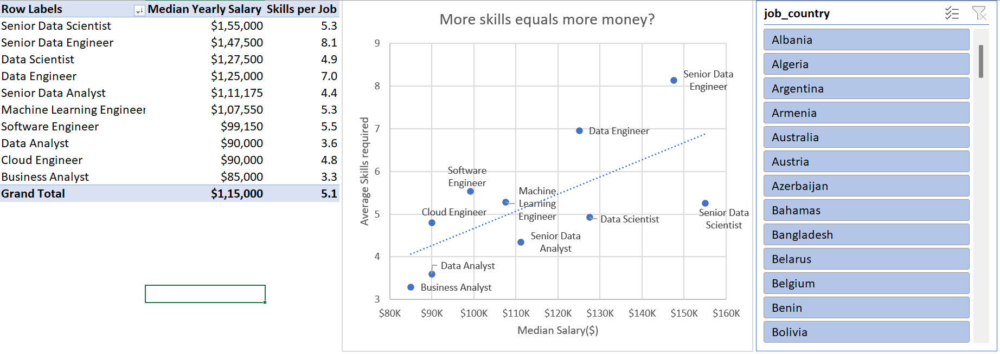
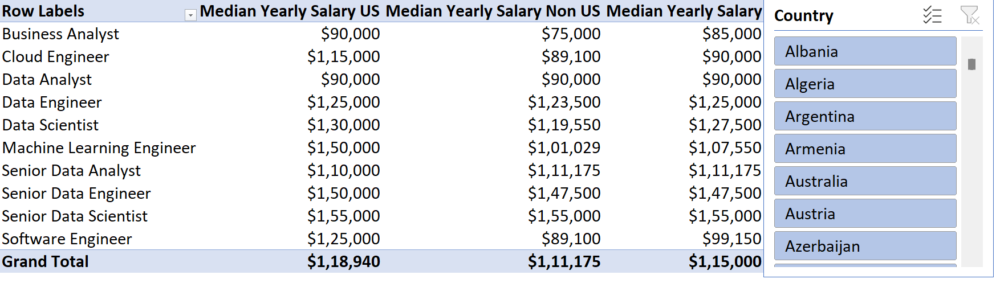
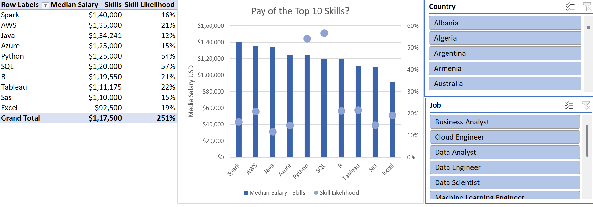

# 📊 Salary Analysis Excel Project

## Introduction  
This project is part of my Excel learning journey. I used a real-world style dataset of job listings to understand how different skills relate to salaries. While working on this project, I learned how to clean data, build summaries, and create simple visual insights. It gave me hands-on experience with Excel tools that are commonly used in data analysis.

---

## 📸 Project Preview  
** 

** 

**

**

---

## 🧰 Excel Skills Used  

- **Power Query** for importing and cleaning raw data  
- **Power Pivot / Data Model** to connect tables using relationships  
- **PivotTables** for summarizing salaries and skill counts  
- **Pivot Charts** to visualize salary comparisons and skill popularity  
- **Basic DAX Measures** (like Median Salary)  
- **General data cleaning** (trimming spaces, fixing data types, removing unnecessary columns)

---

## 🪜 What I Did (Step-by-Step)

1. **Loaded the dataset using Power Query**  
   - Imported the raw job listings and separated them into clean tables.  

2. **Cleaned and transformed the data**  
   - Removed unwanted text, standardized columns, and prepared a skills table.

3. **Created a Data Model**  
   - Linked the Jobs and Skills tables using `job_id`.  

4. **Built PivotTables**  
   - Summarized median salaries by job role, country, and skill.  

5. **Created DAX measures**  
   - Added a simple measure for calculating median salary where needed.  

6. **Made charts**  
   - Built visual charts to compare skill frequency and salary levels.  

7. **Explored insights**  
   - Observed how certain skills relate to higher salaries.

---

## 🔍 Key Findings  

- Jobs listing **more technical skills** usually show **higher median salaries**.  
- **Python and SQL** appeared in many higher-paying roles.  
- Cloud and data engineering skills were often linked to top salaries.  
- Basic office tools (like PowerPoint or Word) had lower salary associations.

---

## Conclusion  
As someone learning Excel, this project gave me valuable practical experience in data cleaning, modeling, and analysis. I learned how to organize large datasets, build meaningful summaries, and create charts that clearly show insights. This project helped strengthen my core Excel skills and gave me more confidence to work on real data analytics tasks.

---
